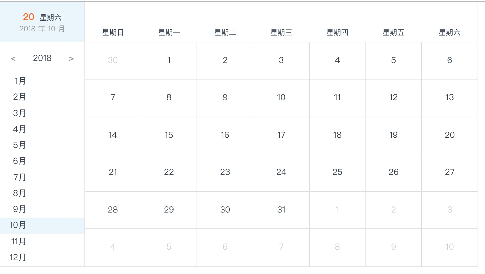
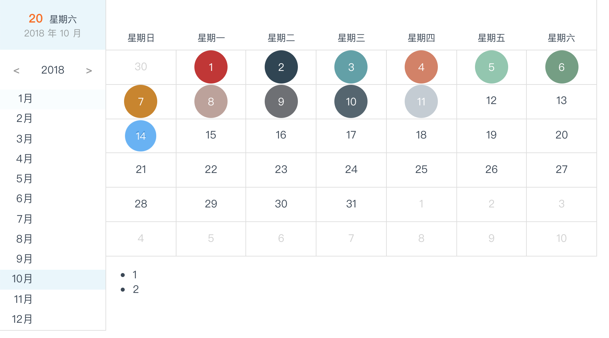

# ty-calendar

```
yarn add ty-calendar
npm i ty-calendar
```
## Example
```js
import Calendar from 'ty-calendar'

export default class Test extends Component {
  render() {
    return <div>
      <Calendar />
    </div>
  }
}
```


```js
import Calendar from 'ty-calendar'

const color = {
  1: '#c23531',
  2: '#2f4554',
  3: '#61a0a8',
  4: '#d48265',
  5: '#91c7ae',
  6: '#749f83',
  7: '#ca8622',
  8: '#bda29a',
  9: '#6e7074',
  10: '#546570',
  11: '#c4ccd3',
} // key代表日期 后面代表颜色代码

export default class Test extends Component {
  render() {
    return <div style={{ height: 800, width: 900 }}>
      <Calendar dataMap={color} />
      <div style={{ height: 300, background: '#000' }}></div>
    </div>
  }
}

```

## Notice
```css
.ty-calendar {
  min-height: 500px; /*default height*/
  min-width: 700px; /*default width*/
}
```
## Props
| 参数 | 说明 | 类型 | 默认值 |
| :------: | :------: | :------: | :------: |
| toggleDay | 日期切换回调函数 | Function (dateinfo) | -- |
| monthEndRender | 月份面板结尾渲染 | Fucntion (month) | -- |
| dataMap | 高亮日期对象  | Map  | {} |
